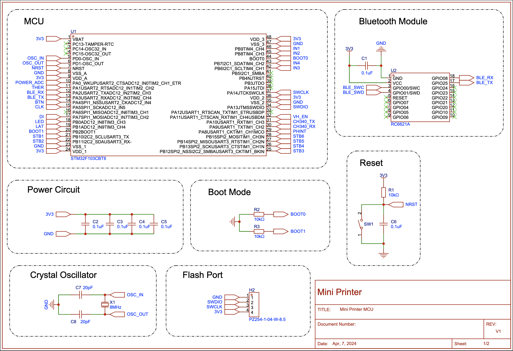
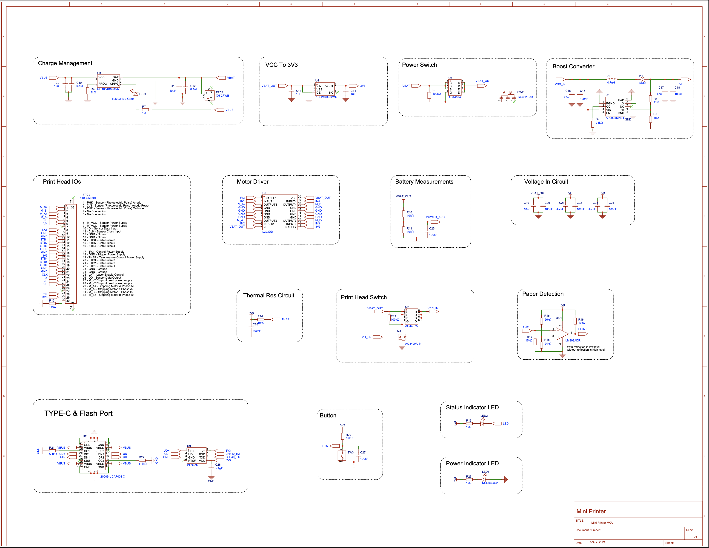
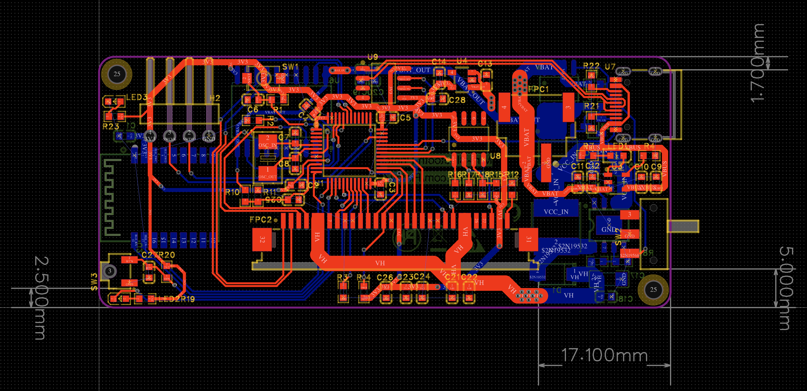
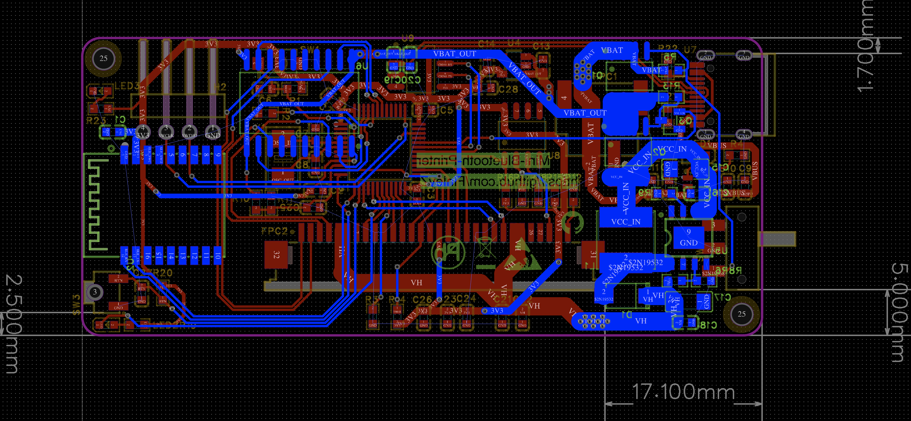
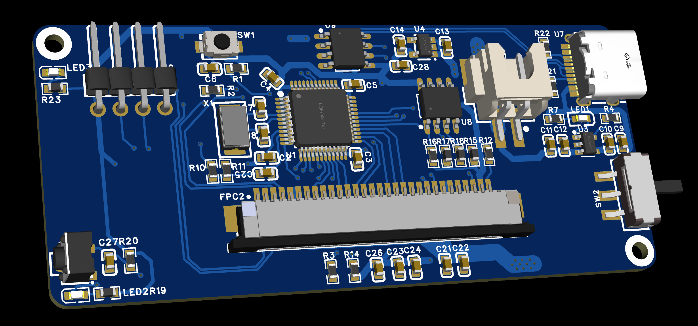
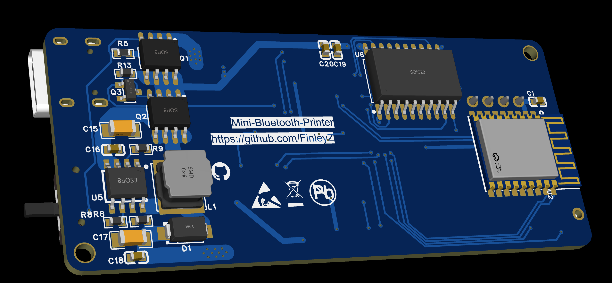

# Mini-Printer Project

## Table of Contents
1. [Project Overview](#project-overview)
2. [Hardware Design](#hardware-design)
3. [Software Design](#software-design)
4. [Usage](#usage)
5. [Demonstration](#demonstration)

## Project Overview
The Mini-Printer project aims to develop a small, portable thermal printer based on the STM32 microcontroller. This project involves both hardware and software components to create a fully functional mini-printer capable of printing text and simple graphics.

The Mini-Printer is a battery-powered, compact thermal printer that uses Bluetooth connectivity for seamless wireless communication. The project was developed using STM32 microcontroller, FreeRTOS, and the HAL (Hardware Abstraction Layer) library to ensure efficient Bluetooth communication and log printing functionalities.

### Key Responsibilities
- Developed modules for battery and temperature monitoring, BLE communication, print tasks, and message queues.
- Used STM32, FreeRTOS, and HAL library for efficient Bluetooth communication and log printing.

### Project Highlights
1. Implemented advanced filtering algorithms for accurate battery and temperature readings.
2. Optimized BLE protocols to prevent packet loss.
3. Enabled dynamic printing of 384x1000 images with only 8k RAM.
4. Increased print efficiency by 50% with adaptive heating control.

This project demonstrates skills in embedded systems, real-time operating systems, Bluetooth communication, and hardware-software integration.

## Hardware Design
### Components
- **Microcontroller**: STM32F103CBT6
- **Thermal Print Head**
- **Power Supply**: 5V DC
- **Battery**: Rechargeable battery for portable operation
- **Communication Interface**: UART
- **Motor Driver**
- **Bluetooth Module**
- **Miscellaneous**: Capacitors, Resistors, Connectors, LEDs, Buttons

### Schematic
The hardware schematic for the Mini-Printer includes various components connected to the STM32F103CBT6 microcontroller. Key connections include the thermal print head, motor driver, Bluetooth module, and power management circuits. The schematic ensures proper power distribution and signal routing to enable the functionalities of the mini-printer. Below is a visual representation of the schematic:

### PCB Layout
The printed circuit board (PCB) layout is designed to fit within a compact form factor of 17.1mm x 5.0mm, optimizing space for all necessary components. The layout includes:
- **Microcontroller Section**: Houses the STM32F103CBT6 and its supporting components.
- **Power Management**: Includes voltage regulators, capacitors, and resistors to manage power supply.
- **Communication Interfaces**: UART connections for Bluetooth module and other serial communications.
- **Motor and Print Head Driver**: Integrates the L293DD motor driver for controlling the stepping motor and thermal print head.
- **Additional Components**: LED indicators, buttons, and connectors for user interaction and external connections.

Here are the images depicting the PCB layout:

**Top Layer:**

**Bottom Layer:**

**3D View (Top):**

**3D View (Bottom):**

These images provide a clear view of the component placement and routing on the PCB, ensuring the mini-printer's functionality and performance.

## Software Design
### Development Tools
- **IDE**: STM32CubeIDE
- **Framework**: STM32CubeMX
- **Programming Language**: C

## Usage

## Demonstration